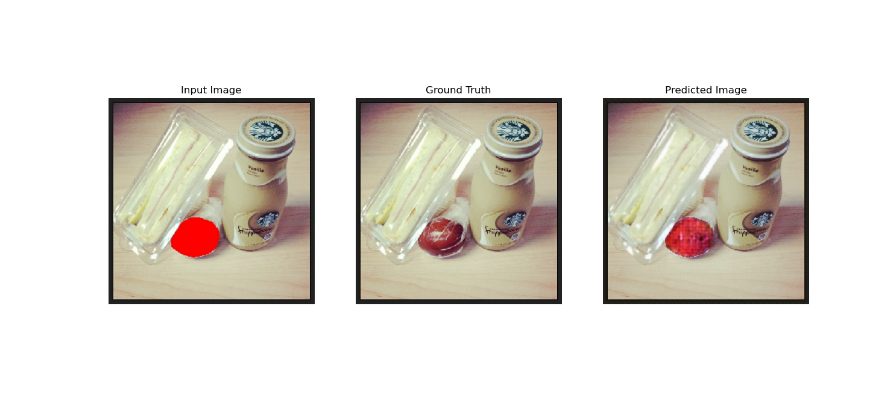
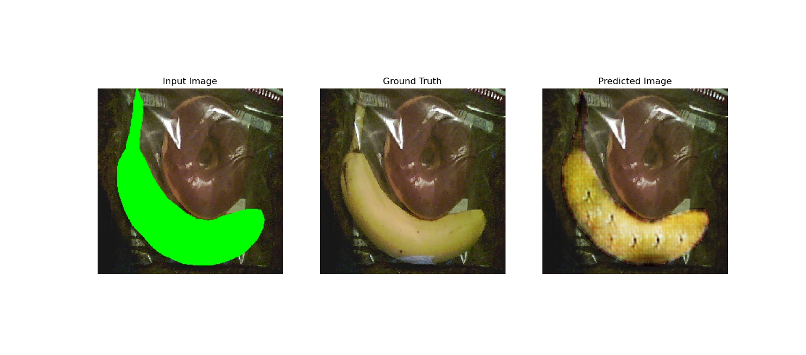
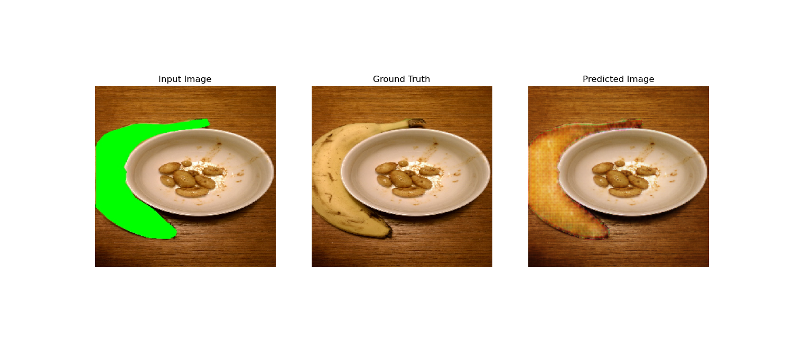

# Pix2Pix for Fruits

This is a mini project where is try to try pix2pix myself, but on fruits. Dataset used is from [COCO-dataset](http://cocodataset.org/#home)

You can find the original paper [here](https://phillipi.github.io/pix2pix/).

You can also find the guide from tensorflow.orh [here](https://www.tensorflow.org/tutorials/generative/pix2pix).

# Objective

Create a model that is able to generate fruits on an any image

### Setting up environment

Take note that i am using ubuntu

1. Install anaconda
1. On your terminal, run `conda create env -f environment.yml`
1. On your terminal. run `conda activate pix2pix_env`

### Generating Data

1. Make sure that you have activated the conda environment
1. Download COCO training and validation dataset and annotations
1. Edit the following variables inside **process_data.py**
```
training_data_dir
validation_data_dir
training_annotation_file
validation_annotation_file
```
1. On your terminal, run `python proces_data.py`
1. The images will now be saved inside the `data/train` and `data/val` folders
1. There are 4193 training data and 200 testing data

### Training

1. Make sure that you have activated the conda environment
1. Make sure you have generated the training and validation dataset
1. Edit the hyperparameters as you like at the top of the `train.py` file
1. Run `python train.py`. This might take some time. On a RTX2060 Super, it took 4~5 min for 1 epoch
1. checkpoints are saved in the `training_checkpoints` folder. Running `train.py` again will start from the latest checkpoint from the checkpoint folder

### Results

The result after running 100 epoch is not great. The results might be better if we use datasets which are more 'fruits focused', eg. with fruits as the main focus of the image.

Below are some of the samples of the better results





### Future improvements

1. Create a dataset which is more 'fruits focused', maybe also crop images with fruits so that the model can learning might be more relevant
1. Run the training on more epochs. The example on tensorflow was ran on 200 epochs, which is 2x this project, and has more dataset
